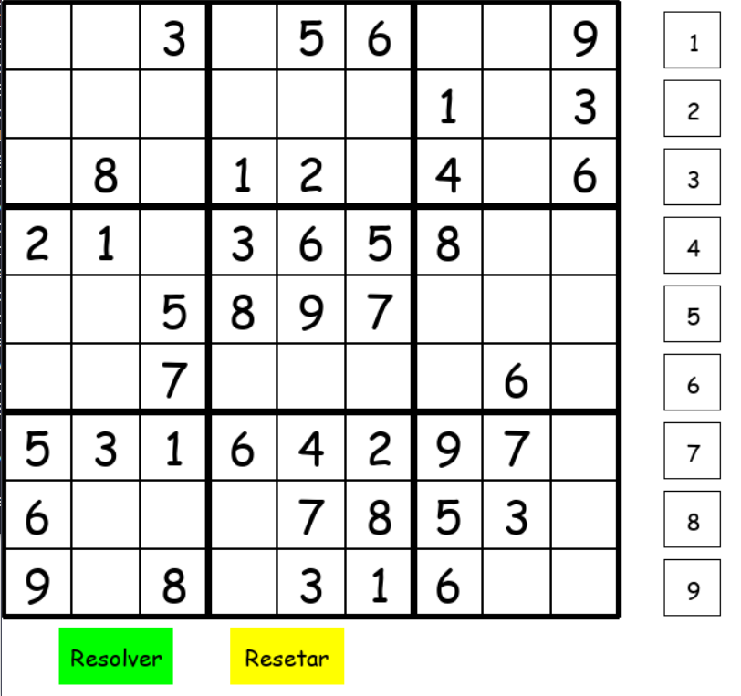

# Sudoku

Um jogo de Sudoku feito com python e a biblioteca pygame. 
Para jogar, basta selecionar um quadrado vazio e com os botões de 1 ao 9 do lado esquerdo você seleciona o valor.
O jogo possui a opção de resolver o sudoku. Foi utilizado um algoritmo de backtracking para resolver o sudoku,
e o procedimento é exibido no jogo à medida que o algoritmo tenta resolvê-lo.

Para poder usar deve ser adicionado o pyGame com o comando: pip install pygame

